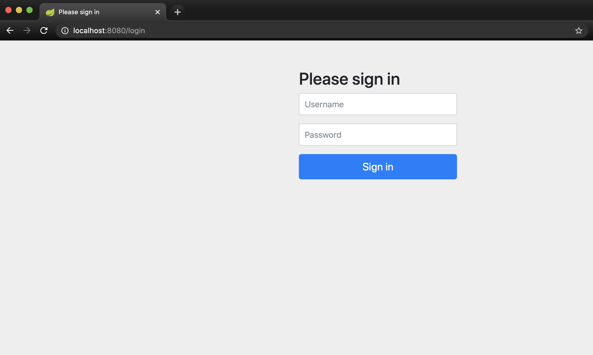
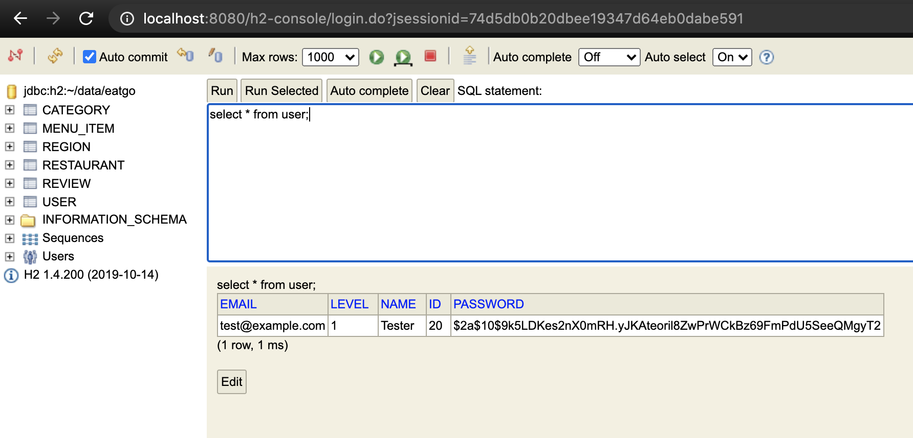

# 스프링 부트 프로젝트
### 레스토랑 예약 사이트 만들기 

#### 45. 회원가입   

BCrypt를 이용한 Hash 암호화를 사용하기 위해   
제공되는 Spring Security 프로젝트 사용  
HttpSecurity 부분을 직접 설정할 예정이다  

회원가입 변수  
Email   
Name  
Password (2회 인증은 보통 front에서)  

 - eatgo-customer-api  
Gradle - Spring security 의존성 추가  
build.gradle
```
dependencies {
    implementation project(':eatgo-common')

    implementation 'org.springframework.boot:spring-boot-starter-web'
    implementation 'org.springframework.boot:spring-boot-starter-security'
    implementation 'org.springframework.boot:spring-boot-starter-data-jpa'
    implementation 'com.h2database:h2'
    
    ...
}
``` 

Spring security를 의존성으로 추가하면 기본적으로 http://localhost:8080/login 페이지가 제공된다.      


그러나 따로 API 서버를 사용하기 때문에 위와같은 페이지가 불필요하다.  

WebSecurityConfig Class를 상속받는 Config Class를 SpringBootApplication Class와 같은 위치에 생성하고 
configure 메서드를 Overriding하여 설정 변경    
```
@Configuration
@EnableWebSecurity
public class SecurityJavaConfig extends WebSecurityConfigurerAdapter {

    @Override
    protected void configure(HttpSecurity http) throws Exception {
        http
                .formLogin().disable() //login page 사용안함  
                //Connection 관련된 부분인데 
                //disable하지 않으면 h2-console을 사용할 수 없어서 일단 설정
                .cors().disable() 
                .csrf().disable()
                .headers().frameOptions().disable();
    }
}
```
    
Service에서 회원가입하는 기능인 registerUser()를 생성하는데
중복 이메일에 대한 예외클래스를 생성하고 사용하며
BCryptPasswordEncoder 클래스를 통해 password를 암호화한다.  
```
    public User registerUser(String email, String name, String password) {
        Optional<User> existed = userRepository.findByEmail(email);
        if (existed.isPresent()) { //email로 찾은 User가 존재한다면 if문 수행
            throw new EmailExistedException(email);
        }

        PasswordEncoder passwordEncoder = new BCryptPasswordEncoder();
        String encodedPassword = passwordEncoder.encode(password); //암호화 
        User user = User.builder()
                .email(email)
                .name(name)
                .level(1L)
                .password(encodedPassword)
                .build();

        return userRepository.save(user);
    }
```

Service Test
```
    //회원가입 테스트 
    @Test
    public void registerUser() {
        String email = "rockintuna@naver.com";
        String name = "이정인";
        String password = "test";
        User mockUser = User.builder().name(name).email(email).password(password).build();
        given(userRepository.save(any())).willReturn(mockUser);

        User user = userService.registerUser(email, name, password);

        assertThat(user.getName(), is("이정인"));

        verify(userRepository).save(any());
    }

    //email 중복 테스트 
    @Test(expected = EmailExistedException.class)
    public void registerUserWithExistEmail() {
        String email = "rockintuna@naver.com";
        String name = "이정인";
        String password = "test";
        User mockUser = User.builder().name(name).email(email).password(password).build();

        given(userRepository.findByEmail(email)).willReturn(Optional.of(mockUser));

        userService.registerUser(email, name, password);

        verify(userRepository,never()).save(any());
    }
```

사용자 예외 클래스  
```
public class EmailExistedException extends RuntimeException{

    EmailExistedException(String email) {
        super("Email is already registered: "+email);
    }
}
```

계정 생성
```shell script
$ http POST localhost:8080/users email=test@example.com name=Tester password=test
```

DB에는 암호화된 암호가 저장된다.  


한번더 같은 메일로 생성하면 생성한 예외 발생
```shell script
$ http POST localhost:8080/users email=test@example.com name=Tester password=test
HTTP/1.1 500 
Cache-Control: no-cache, no-store, max-age=0, must-revalidate
Connection: close
Content-Type: application/json;charset=UTF-8
Date: Fri, 19 Jun 2020 09:39:13 GMT
Expires: 0
Pragma: no-cache
Transfer-Encoding: chunked
X-Content-Type-Options: nosniff
X-XSS-Protection: 1; mode=block

{
    "error": "Internal Server Error",
    "message": "Email is already registered: test@example.com",
    "path": "/users",
    "status": 500,
    "timestamp": "2020-06-19T09:39:13.802+0000",
    "trace": 
~~~
```
    
    